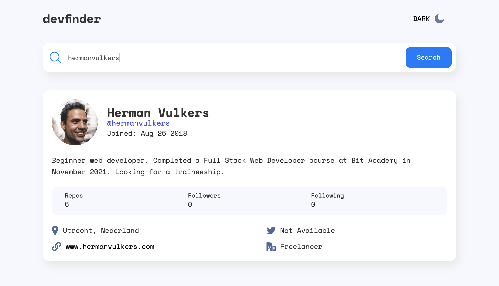

# Herman Vulkers - devfinder

I created this dashboard as a practice project to further develop my API integration, JavaScript, HTML and CSS skills. This code is the solution to one of the challenges developed by frontendmentor.io. They provided the raw materials, such as the text and the images. I did all of the codework. 

## Table of contents

- [Overview](#overview)
  - [The challenge](#the-challenge)
  - [Screenshot](#screenshot)
  - [Links](#links)
- [My process](#my-process)
  - [Built with](#built-with)
  - [What I learned](#what-i-learned)
  - [Continued development](#continued-development)
  - [Useful resources](#useful-resources)
- [Author](#author)
- [Acknowledgments](#acknowledgments)

## Overview

### The challenge

Users should be able to:

- View the optimal layout for the app depending on their device's screen size
- See hover states for all interactive elements on the page
- Search for GitHub users by their username
- See relevant user information based on their search
- Switch between light and dark themes
- **Bonus**: Have the correct color scheme chosen for them based on their computer preferences. _Hint_: Research `prefers-color-scheme` in CSS.

### Screenshot

### Links

- Live Site URL: [Add live site URL here](https://hermanvulkers.github.io/devfinder/)

## My process

### Built with
- JavaScript (GitHub API, localStorage, prefers-color-scheme, set/getItem)
- Semantic HTML5 markup
- CSS Grid
- CSS Flexbox

### What I learned

Through this project I got an understanding of the way that API's can be used to fetch JSON data, and how this JSON data can be stored and used to manipulate the DOM. I also further refined my dark / light mode code compared to previous apps/websites that I built. There was also considerable time spent on the layout and responsiveness through CSS.

### Useful resources

- [Example resource 1](https://docs.github.com/en/rest/reference/users) - GitHub's official documentation on their API helped me understand how to fetch userdata from their server. It was not as complicated as I expected.

## Author

- Website - [Add your name here](https://www.hermanvulkers.com)
- Frontend Mentor - [@hermanvulkers](https://www.frontendmentor.io/profile/yourusername)

